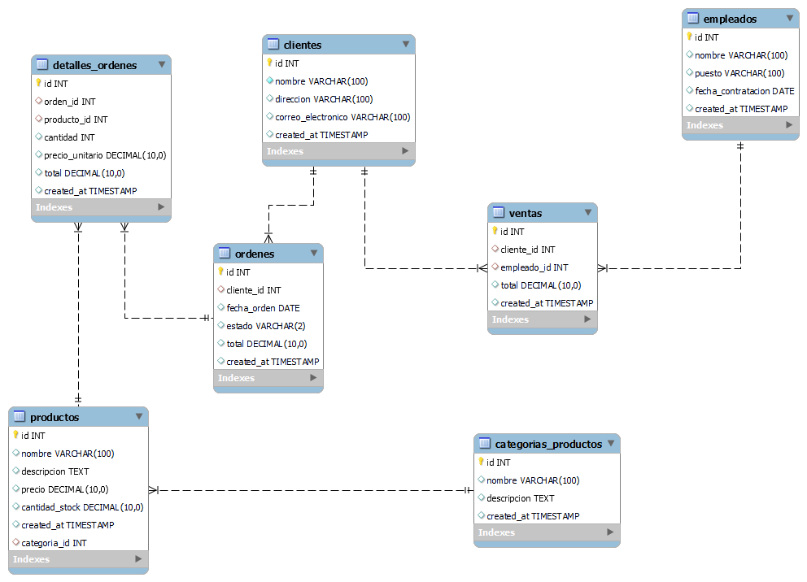

# Diplomatura en Full Stack - UTN.BA
## BackEnd
### Indice

* <a href="#practico1">Práctico 1 (Aplicación simple)</a>
* <a href="#practico2">Práctico 2 (DB con MySQL)</a>


<a name="practico1"></a>
### Práctico N 1

Consigna de trabajo práctico integral de poo

Vas a desarrollar una aplicación simple para gestionar una biblioteca de libros. La aplicación deberá hacer uso de TypeScript y aplicar los conceptos de Programación Orientada a Objetos, incluyendo encapsulamiento, el uso de interfaces, clases, métodos, y la composición de objetos.

1. Crea un archivo Persona.ts:
   - Define una interfaz Persona con las propiedades nombre y apellido.
   - Implementa una clase Autor que cumple con la interfaz Persona. Esta clase debe tener un constructor que reciba el nombre y el apellido del autor.

2. Crea un archivo libro.ts:
   - Define una interfaz Libro con las propiedades titulo, autor (de tipo Autor), y el método obtenerResumen().
   - Implementa una clase LibroImpreso que cumple con la interfaz Libro. Esta clase debe tener un constructor que reciba el título y el autor del libro.

3. Crea un archivo biblioteca.ts:
   - Implementa una clase Biblioteca que representará la biblioteca. Esta clase debe tener una propiedad privada libros que sea un array de objetos que cumplen con la interfaz Libro.
   - Implementa un método agregarLibro(libro: Libro) que permita agregar un libro a la biblioteca.
   - Implementa un método mostrarCatalogo() que muestre por consola el catálogo de libros de la biblioteca.

4. Crea un archivo index.ts:
   - En este archivo, importa las clases y interfaces necesarias de los archivos anteriores.
   - Crea instancias de objetos para representar autores y libros.
   - Crea una instancia de la biblioteca.
   - Agrega algunos libros a la biblioteca usando el método agregarLibro.
   - Muestra el catálogo de la biblioteca usando el método mostrarCatalogo.

### Instalación
Una vez clonado ejecutar.
```
   npm install
```
### Ejecución
```
   npm run start
```

### Diagrama de clases
<p align="center">
   
</p>

### Captura de resultado


<a name="practico2"></a>
### Práctico 2
<a href="./db/dump-tienda-202404092320.sql"> Tienda (Base de datos)
<br><br>
